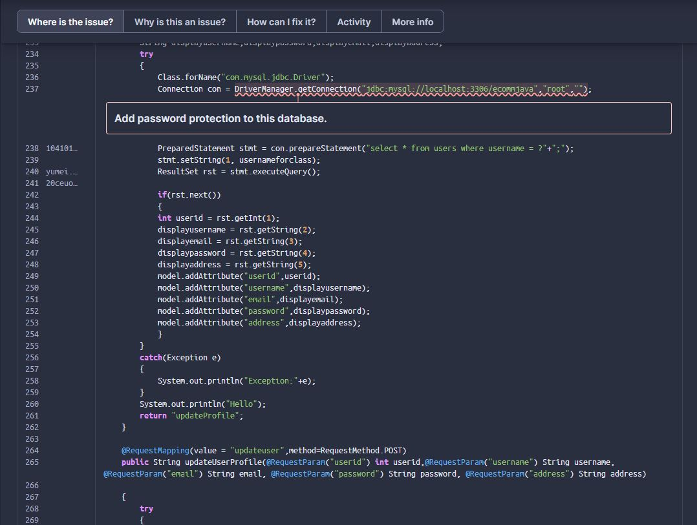

# Architectural Smells

Durante el estudio y desarollo de las diferentes actividades del curso he logrado
identificar ciertos Architectural Smells que estan en el proyecto, estos smells
mayormente vienen de la falta de una planeación adecuada y una visión a futuro
del crecimiento del proyecto:

## Código Inadecuadamente Documentado: 

El funcionamiento de la aplicacion es explicado en el archivo [README.md](README.md) pero hace falta una parte muy importante de la documentacion, esta es explicar el codigo dentro la aplicacion, desde el principio de la creacion del repositorio no se 
genero una planeacion en la que le codigo estuviera documentado con la finalidad de que nuevos desarrolladores pudieran entrar al proyecto y poder entender que se esta realizando.

Esto complica un poco el desarrollo de nuevas funcionalidades puesto que siendo un repositorio abierto muchas personas pueden acceder a este pero no se tiene una
organizacion que facilite la posibilidad de que los desarrolladores conozcan el contexto de la aplicación ya que es necesario analizar todo el codigo y como veremos mas adelante hay practicas de mala calidad en el proyecto.

## Acoplamiento Excesivo y código duplicado:

Dentro del proyecto hay dos grndes factores que puden generar problemas a largo plazo, 
como por ejemplo, dentro de la clase [UserController.java](./JtProject/src/main/java/com/jtspringproject/JtSpringProject/controller/UserController.java) existe codigo duplicado que puede afectar al rendimiento ya que intenta validar si un objeto esta dentro de una lista varias veces y ademas de que esta modificando la clase [User.java](./JtProject/src/main/java/com/jtspringproject/JtSpringProject/models/User.java) rompiendo los principios SOLID.

## TDD (Test Driven Development):

En un principio no existian pruebas que sirvieran para comprobar el correcto funcionamiento de la aplicación y para poder
mejorar la refactorización del codigo, asi que fue necesario crear las pruebas
desde 0 con el uso de Mockito.

Que las pruebas no esten planeadas desde unprincipio es un error muy grave, ya que no existe forma de comprobar que el software si realiza lo que se espera que haga.

## Existencia de un monolito:

El proyecto esta desarrollado como un monolito y al ser una plataforma de comercio electronica no creo que sea la arquitectura mas adecuada puesto que si hay una
alta demanda los servicios no van a ser capaces de escalar y posiblemente se genere
una afectacion al servicio que se esta prestando.

Para una plataforma como esta deberia ser necesario separar el front del back y manejar balanceadores de carga que puedan distribuir las peticiones a diferenetes instancais
con la finalidad de implemetar una arquitectura de microservicios que pueda suplir
la demanda a la que la plataforma puede enfrentarse en un futuro.

## Seguridad

Este proyecto tiene ciertos temas de seguridad muy importantes que son necesarios resolver, pero que en un principio no habia forma sencilla de identificar.

Desde un principio el proyecto no contaba con ninguna integracion con aplicaciones de terceros,
asi que una vez logré implementar SonarCloud pude descrubrir que habian varias 
cosas de seguridad que no pueden dejarse pasar y mas en una plaicaion de comercio
donde el usuario puede usar metodos de pago y la informacion de este es almacenada 
en una base de datos.

Las mas llamativa es la siguiente:

En donde la base de datos no tiene contraseña para el usuario root, siendo una vulnerabilidad que se puede explotar facilmente.

## No existe el Continuous Integration:

Para poder mantener una buena calidad del codigo es necesaria la planeacion de
un proceso de CI que ayude a identificar errores, fallas en las dependencias,
problemas en la compilación del proyecto y la ejecución de pruebas.

El proyecto dentro del repositorio no contaba con ninguna de estas
funcionalidades y es una falla muy grande ya que eso implica que no existia un
control en el funcionamiento del proyecto, podria ser que se hicieran cambios
que modificaran el proyecto y que generaran mas vulnerabilidades e incluso se
usaran dependencias que tuvieran problemas de seguridad o estuvieran desactualizadas.

Con herramientas como SonarCloud es posible identificar estos problemas y GitHub permite el uso de sus Actions para poder hacer del proceso de CI mucho mas facil
y que agregue valor al proyecto para presentar una buena calidad del mismo.

## Referencias:

- [Analyzing Architecture Quality Evolution](https://tusharma.medium.com/analyzing-architecture-quality-evolution-2618b722b81e)
- [What are architectural smells?](https://www.arcan.tech/blog/what-are-architectural-smells/)
- [Architecture Smells - Detection And Refactoring](https://www.c-sharpcorner.com/article/architecture-smells-detection-and-refactoring/)