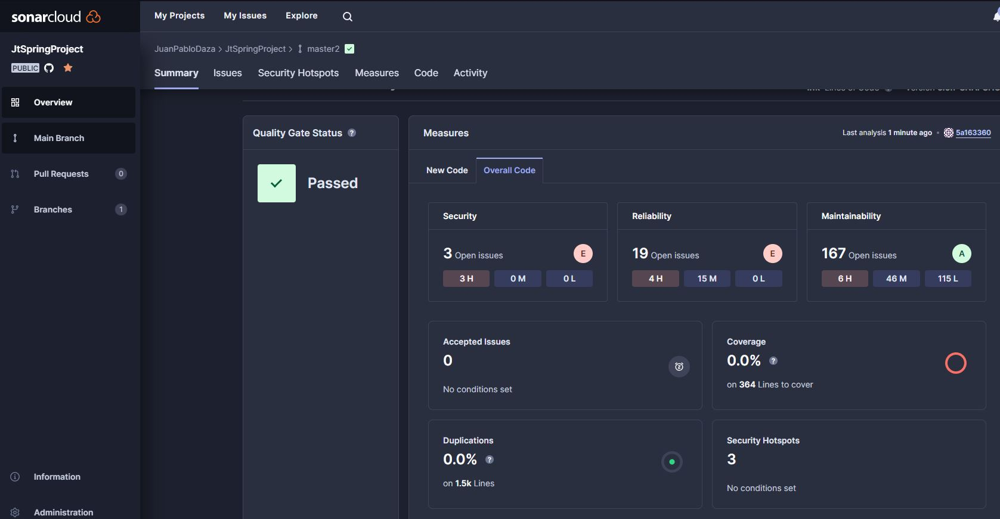

# CSDT-2024

Este repositorio contiene el proyecto de E-commerce desarrollado por [jaygajera17](https://github.com/jaygajera17) con la finalidad de analizarlo y realizar ciertos cambios para el curso de CSDT en el noveno semestre de la Universidad.

El objetivo de este repositorio es documentar los Code Smells presentes en el código y identificar técnicas de refactoring aplicables para mejorar la calidad del software.

## Indice

* [Actividad Code Smells y Refactoring](#actividad-code-smells-y-refactoring)
* [Clean Code y XP Practices](#actividad-clean-code-y-xp-practices)
* [DevEx y SPACE](#actividad-devex-y-space)
* [Integracion Continua](#actividad-integracion-continua-ic)

# Actividad Code Smells y Refactoring

## Code Smells

Durante el análisis del código, se identificarán diferentes Code Smells, que son indicadores de posibles problemas en el diseño o implementación del software. Algunos ejemplos de Code Smells comunes incluyen:

- Duplicación de código
- Métodos o clases demasiado largas
- Nombres de variables o funciones confusos
- Falta de documentacion
- Falta de pruebas
- Lineas de codigo docuementadas

## Técnicas de Refactoring

Una vez identificados los Code Smells, se aplicarán técnicas de refactoring para mejorar el diseño y la estructura del código. Algunas técnicas de refactoring comunes incluyen:

- Extracción de métodos
- Eliminación de duplicación de código
- División de clases o métodos grandes en componentes más pequeños
- Mejora de la legibilidad del código
- Creacion de pruebas unitarias

## Github Copilot

Para el proyecto se incentiva el uso de GitHub Copilot para la asistencia en la identificacion de Code Smells y sugerencias de Refactoring, por ejemplo, tome la clase [UserController.java](JtProject/src/main/java/com/jtspringproject/JtSpringProject/controller/UserController.java) y le pedi a Copilot que identificara Code Smells y sugiriera tecnicas de refactoring, su respuesta fue esta:

#### Respuesta de Copilot:

¡Claro! Aquí hay algunas sugerencias basadas en el código que proporcionaste:

Long Method: Los métodos userlogin y newUseRegister son bastante largos y hacen varias cosas. Podrías considerar dividir estos métodos en submétodos más pequeños, cada uno con una única responsabilidad.

Duplicated Code: Hay código duplicado en los métodos userlogin y getproduct donde se verifica si la lista de productos está vacía. Podrías considerar extraer este código a un método separado.

Feature Envy: El método newUseRegister parece estar más interesado en la clase User que en su propia clase. Podrías considerar mover este método a la clase User.

Data Clumps: Los parámetros username y password siempre se pasan juntos. Podrías considerar introducir un objeto de transferencia de datos (DTO) para agrupar estos parámetros.

Comments: Hay comentarios que indican que ciertos métodos son para "propósitos de aprendizaje". Si estos métodos no son necesarios para la funcionalidad de la aplicación, podrías considerar eliminarlos.

Dead Code: Hay un método comentado al final del archivo. Si este método no se utiliza, deberías considerar eliminarlo.

Magic Strings: Hay varias cadenas de texto (como "ROLE_NORMAL", "userLogin", "register", etc.) que se utilizan en varias partes del código. Podrías considerar reemplazar estas cadenas mágicas con constantes.

Inappropriate Intimacy: El método userlogin está directamente accediendo y manipulando los detalles del objeto User. Podrías considerar encapsular estos detalles dentro de la clase User.

Espero que estas sugerencias te sean útiles para mejorar la calidad de tu código.

#### Fin respuesta de Copilot:

Como podemos ver Copilot encontro mas Code Smells que los que se habian planteado principalmente y sugirio tecnicas de Refactoring para mejorar la calidad del codigo.

# Actividad Clean Code y XP Practices

## Clean Code

Usando la misma clase [UserController.java](JtProject/src/main/java/com/jtspringproject/JtSpringProject/controller/UserController.java), podemos identificar las siguienetes prácticas de Clean Code:

* Usar un Logger y no un System.out.println().
* Realizar la documentación de los metodos.
* Llamar de una mejor manera el mapeo de url, ya que /test es muy ambiguo.

Ahora, como ya lo habia realizado antes, utilizaré Copilot para que me ayude a identificar mas practicas de Clean Code que puedan ser usadas:

#### Respuesta de Copilot:

Organización de las importaciones: Las importaciones deben estar organizadas alfabéticamente y sin duplicados para facilitar la lectura. En tu código, parece que com.jtspringproject.JtSpringProject.services.cartService está importado dos veces.

Nombres de paquetes: Los nombres de paquetes deben seguir las convenciones de Java, que es todo en minúsculas. En tu código, JtSpringProject tiene letras mayúsculas.

Inyección de dependencias: Estás utilizando la anotación @Autowired para inyectar dependencias, lo cual está bien, pero la inyección a través del constructor es una mejor práctica porque hace que las dependencias sean explícitas, facilita las pruebas unitarias y evita el problema de la inyección de campos nulos.

Nombres de clases y métodos: Los nombres de las clases deben ser sustantivos y los nombres de los métodos deben ser verbos. Además, deben ser descriptivos y reflejar su propósito. Por ejemplo, el método Test podría tener un nombre más descriptivo.

Uso de System.out.println: Considera usar un logger en lugar de System.out.println. Los loggers proporcionan niveles de log, lo que puede ser útil para controlar qué mensajes se muestran en diferentes entornos (desarrollo, producción, etc.).

Manejo de excepciones: Asegúrate de que estás manejando las excepciones adecuadamente. No deberías tener bloques catch vacíos y deberías proporcionar mensajes de error significativos.

Comentarios: Los comentarios deben usarse con moderación y sólo cuando sean necesarios. Si sientes la necesidad de agregar un comentario, primero intenta hacer que el código sea más autoexplicativo.

Espaciado y formato: Asegúrate de que estás siguiendo las convenciones de espaciado y formato de Java para facilitar la lectura del código.

Código muerto: Elimina el código comentado si no es necesario, ya que puede confundir a otros desarrolladores.

Consistencia: Mantén la consistencia en tu código. Por ejemplo, si estás utilizando la anotación @GetMapping para los métodos de solicitud GET, entonces utiliza @PostMapping para los métodos de solicitud POST en lugar de @RequestMapping.

Seguridad: No deberías imprimir contraseñas o cualquier otra información sensible en los logs. En tu código, estás imprimiendo la contraseña del usuario con System.out.println(pass);.

Validación: Deberías validar los datos de entrada antes de usarlos. En tu código, estás asumiendo que el objeto User devuelto por userService.checkLogin(username, pass) no es nulo antes de llamar a u.getUsername(). Esto podría causar una NullPointerException si checkLogin devuelve nulo.

#### Fin respuesta de Copilot

## XP Practices:

Para las practicas XP hay varias que se pueden usar para mejorar el código:

* Refactorign: Puede ser un poco obvia pero es la finalidad del ejercicio y el código si necesita algunos cambios para que sea mucho mejor.
* Test Driven Development: El proyecto no tiene ni una sola prueba, lo que deberia cambiar para poder lograr un cubrimiento mucho mas alto del código por parte de las pruebas.
* Continuous Integration: Sería una buena adición para poder tener un registro de lo que se hace y en caso de despligue se pueda tener una automatización.
* Pair Programming: La progrmación a pares nos daría una gran adición ya que se podria tener un control mas grande de lo que se escribe y como funciona el código ya que se podría dar una retroalimentación mas temprana del estado del código.

# Actividad DevEx y SPACE

## DevEx

DevEx evalua la experiencia del desarrollador analizando herramientas, prácticas y procesos del proyecto afectan la eficiencia y la satisfacción del desarrollador.

En este caso voy a analizar 3 aspectos dentro del proyecto:

### Facilidad de uso de las herramientas

El contenido del proyecto no tiene mucha documentacion, nada mas que algunos comentarios
y trozos de codigo que se estaban intentando implementar pero no llegaron a nada.

Es facil de entender para que sirve el proyecto ya que el README lo explica bien,
pero el codigo no esta documentado, asi que eso dificulta la identificación de
los procesos y que hace cada función.

### Pruebas

Dentro del proyecto en un principio no habina pruebas, lo que dificulta ver si el 
programa si esta funcionando como se quiere, ya que puede que simplemente se omitan errores para garantizar el compilamiento pero no la mantenimbilidad.

Como un ejercicio anterior, se propuso hacer el desarrollo de pruebas unitarias 
para poder generar un cubrimiento mucho mayor y lograr probar el correcto
funcionamiento del codigo.

### Integración y despliegue continuo

No hay proceso de integración continua ni de despliegue, es una activida que se
espera realizar en un futuro.

## SPACE

Es una metodología que evalúa cómo el proyecto gestiona Satisfaction,
Performance, Activity, Communication y Efficiency.

### Satisfaction

El proyecto es interesante, pero si se hubiera agradecido que hubiera mas
documentación o el desarrollo de mas pruebas.

### Performance

Existe una alta deuda técnica en documentación y en pruebas, ya que entender 
el proyecto en un principio fue complicado y las pruebas son muy importantes para 
corroborar el correcto funcionamiento del software.

### Activity

Hasta este punto he identificado las deudas técnicas de documentación y pruebas,
ademas he sugerido cambios de refactorización en el codigo. Tambien he podido
impementar algunas prubas unitarias y realizar un analisis con IA desde el inicio
del curso.

### Communication

Ya que es un trabajo individual es muy dificil analizar la comunicación, pero creo
que el proyecto seria relativamente sencillo de manejar una buena comunicación 
debido a su tamaño.

### Efficiency

La eficiencia es muy grande, porque el tamaño del proyecto lo hace facil de
estudiar y la idea es reducir el retrabajo relizando una buena estructura que
sustente un cambio que de buenos resultados y que sea un punto de apoyo en 
el desarrollo.

## Oportunidades de Mejora y Métricas

Como ya lo habia resaltado en otras actividades anteriormente, es necesario
las pruebas y la docuemntación y podria ser muy eficiente la implementación 
de SonarCloud con el objetivo de analizar la cobertura.

Asi mismo la refactorizacion del codigo es una opcion bastante factible debido a
que ya se han identificado algunas falencias que son necesarias corregir.

## Aplicación IA

La IA con la que he estado ayudandome a analizar el proyecto es GtiHub Copilot, 
la cual me ha ayudado a identificar metodos de refactoring, eso lo podemos ver en 
otra actividad donde [usé Copilot](#github-copilot). Tambien, utilice las sugerencia de Copilot para realizar las pruebas unitarias del proyecto.

# Actividad Integracion Continua (IC)

Como primera parte, ya tenia un workflow con SonarCloud para generar un reporte de la aplicacion, pero este
no estaba funcionando por la conexiones a la base de datos, asi que es necesario solucionar eso primero.

EL rpincipal porblema es que al ejecutar las pruebas estas estaban intentando conectarse a la base de datos, es decir, Mockito no estaba haciendo su trabajo, por eso le pregunte a Copilot:

### Respuesta Copilot

Si tus pruebas están intentando acceder a la base de datos a pesar de que estás usando Mockito, es probable que estés cargando el contexto de Spring en tus pruebas. Esto puede suceder si estás utilizando anotaciones como @SpringBootTest, @DataJpaTest, @WebMvcTest, etc. en tu clase de prueba.

Para evitar cargar el contexto de Spring y solo probar la lógica de tu servicio, puedes usar la anotación @ExtendWith(MockitoExtension.class) de JUnit 5 en lugar de las anotaciones de Spring. Esto te permitirá usar Mockito sin cargar todo el contexto de Spring.

Aquí tienes un ejemplo de cómo podría verse tu clase de prueba:

```
import org.junit.jupiter.api.Test;
import org.junit.jupiter.api.extension.ExtendWith;
import org.mockito.InjectMocks;
import org.mockito.Mock;
import org.mockito.junit.jupiter.MockitoExtension;

import static org.junit.jupiter.api.Assertions.assertEquals;
import static org.mockito.Mockito.when;

@ExtendWith(MockitoExtension.class)
public class CartServiceTest {

    @Mock
    private CartDao cartDao;

    @InjectMocks
    private CartService cartService;

    @Test
    public void testAddCart() {
        Cart cart = new Cart();
        when(cartDao.addCart(cart)).thenReturn(cart);

        Cart result = cartService.addCart(cart);

        assertEquals(cart, result);
    }
}
```

Con esta configuración, CartServiceTest no intentará cargar el contexto de Spring y no intentará conectarse a la base de datos.

### Fin de respuesta Copilot

Ahora realizare los cambios para ver si esto soluciona el problema, hay que recorda que se debe crear el secreto de SonarCloud en el 
repositorio.

Ya una vez solucionado lo de SonarCloud podemos hacer uso de las GitHub Actions, en especifico "Java with Maven", la cual
compilara el projecto y ejecutara las pruebas automaticamente para comprobar el correcto funcionamiento.

Para terminar incluire "Dependency Review" que me da la informacion de si las dependencias son seguras o no al momento de abrir un pull request.

## SonarCloud

Tengo un fallo de SonarCloud cuando este se ejecuta sobre una rama distinta a master2 o cuando se hace ejecuta en en pull request, esto son
problemas de la configuracion de SonarCloud pero no he logrado solucionarlos, pero al momento de hacer el merge de las ramas a master2 se ejecuta
correctamente y podemos ver el siguiente analisis en SonarCloud:




Ahora, haciendo una lista de los workflows implementados:

* Dependency Review: Revisa las dependencias cuando se abre una pull request.
* Java CI with Maven: Compila el proyecto y ejecuta sus prubas para garantizar el correcto funcionamiento.
* SonarCloud: Analisa el codigo del proyecto y genera un reporte en SonarCloud.

Con estas tres implementaciones podemos demostrar que GitHubs Actions es muy util y nos ayuda a los desarrolladores a
mejorar la calidad de nuestro codigo.

La rama Comprobacion-CI se creara para corroborar que todas las implementaciones funcionan.