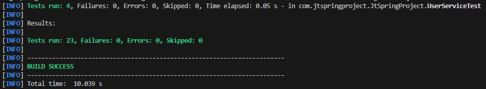
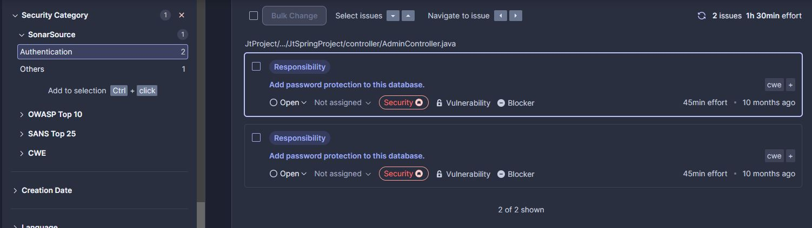
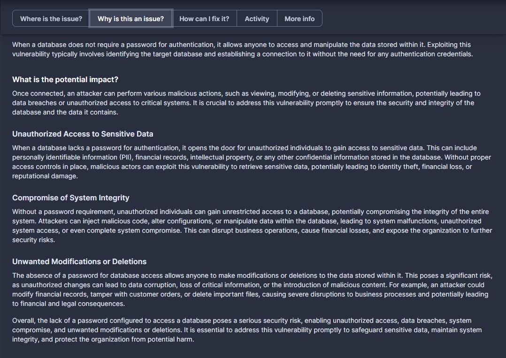
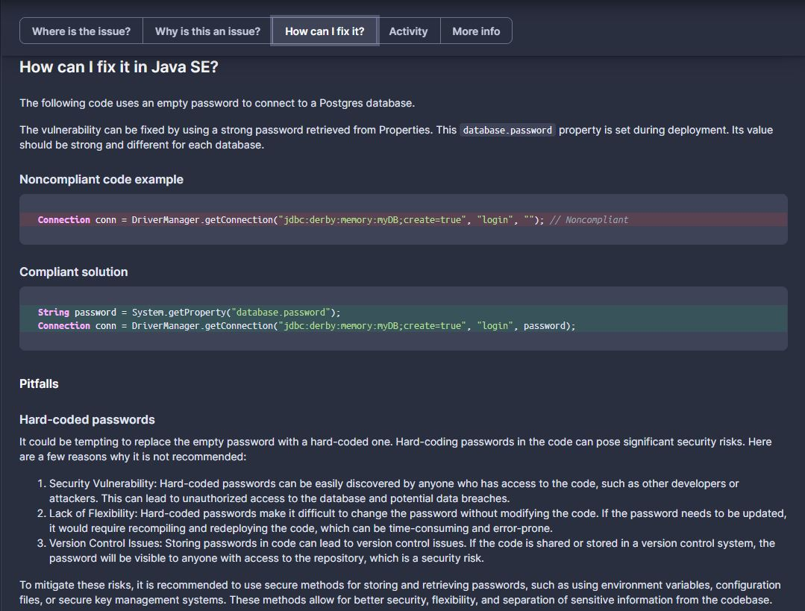
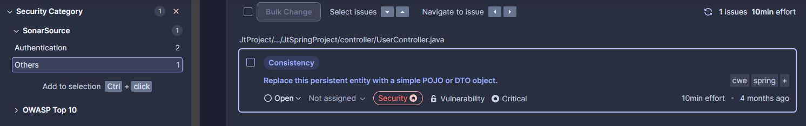
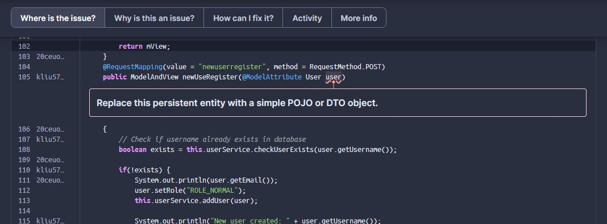
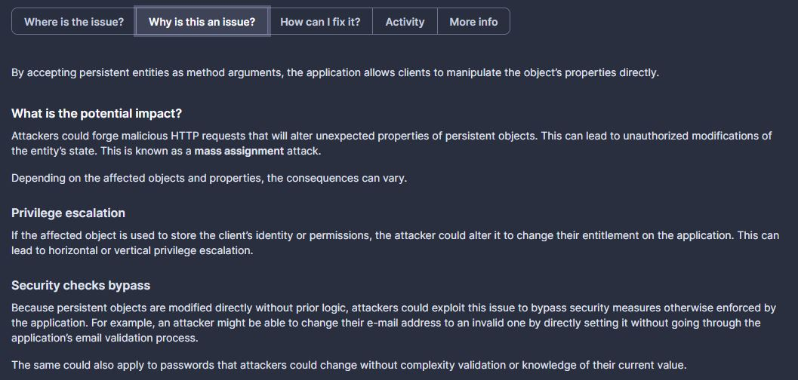
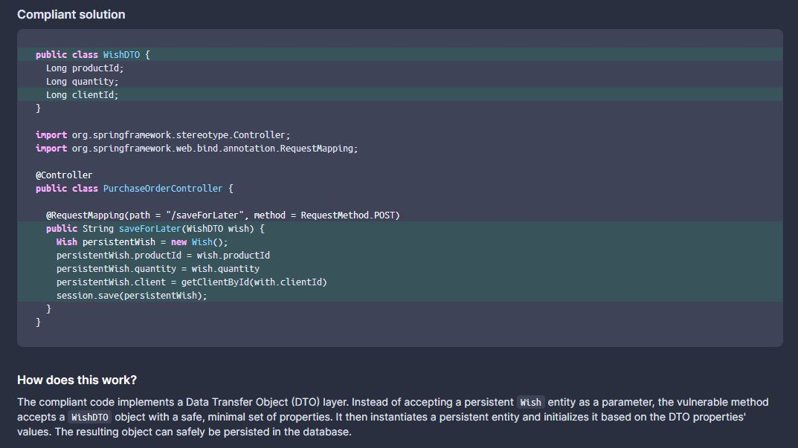
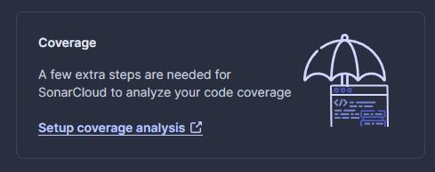

# Primera entrega

### Juan Pablo Daza Pinzon - Calidad de Software y Gestión de Deuda Técnica

## Introduccion

Esta primera entrega consta de un analisis de un [repositorio](https://github.com/jaygajera17/E-commerce-project-springBoot)
publico en el cual se identificaran Code Smells y se sugiriran tecnicas de Refactoring
con la finalidad de poder mejora la calidad del software y mejorar los trabutos de calidad
como la mantenimbilidad.

## Indice

* [CodeSmells y Refactoring](#codesmells-y-refactoring)
* [Clean Code y XP Practices](#clean-code-y-xp-practices)
* [Testing Debt](#testing-debt)
* [Analisis de SonarCloud](#analisis-de-sonarcloud)
* [Conclusiones](#conclusiones)

## CodeSmells y Refactoring

### CodeSmells

Durante el análisis del código, se identificarán diferentes Code Smells, que son indicadores de posibles problemas en el diseño o implementación del software. Algunos ejemplos de Code Smells comunes incluyen:

- Duplicación de código
- Métodos o clases demasiado largas
- Nombres de variables o funciones confusos
- Falta de documentacion
- Falta de pruebas
- Lineas de codigo documentadas

### Técnicas de Refactoring

Una vez identificados los Code Smells, se aplicarán técnicas de refactoring para mejorar el diseño y la estructura del código. Algunas técnicas de refactoring comunes incluyen:

- Extracción de métodos
- Eliminación de duplicación de código
- División de clases o métodos grandes en componentes más pequeños
- Mejora de la legibilidad del código
- Creacion de pruebas unitarias

### Github Copilot

Para el proyecto se incentiva el uso de GitHub Copilot para la asistencia en la identificacion de Code Smells y sugerencias de Refactoring, por ejemplo, tome la clase [UserController.java](JtProject/src/main/java/com/jtspringproject/JtSpringProject/controller/UserController.java) y le pedi a Copilot que identificara Code Smells y sugiriera tecnicas de refactoring, su respuesta fue esta:

#### Respuesta de Copilot:

¡Claro! Aquí hay algunas sugerencias basadas en el código que proporcionaste:

Long Method: Los métodos userlogin y newUseRegister son bastante largos y hacen varias cosas. Podrías considerar dividir estos métodos en submétodos más pequeños, cada uno con una única responsabilidad.

Duplicated Code: Hay código duplicado en los métodos userlogin y getproduct donde se verifica si la lista de productos está vacía. Podrías considerar extraer este código a un método separado.

Feature Envy: El método newUseRegister parece estar más interesado en la clase User que en su propia clase. Podrías considerar mover este método a la clase User.

Data Clumps: Los parámetros username y password siempre se pasan juntos. Podrías considerar introducir un objeto de transferencia de datos (DTO) para agrupar estos parámetros.

Comments: Hay comentarios que indican que ciertos métodos son para "propósitos de aprendizaje". Si estos métodos no son necesarios para la funcionalidad de la aplicación, podrías considerar eliminarlos.

Dead Code: Hay un método comentado al final del archivo. Si este método no se utiliza, deberías considerar eliminarlo.

Magic Strings: Hay varias cadenas de texto (como "ROLE_NORMAL", "userLogin", "register", etc.) que se utilizan en varias partes del código. Podrías considerar reemplazar estas cadenas mágicas con constantes.

Inappropriate Intimacy: El método userlogin está directamente accediendo y manipulando los detalles del objeto User. Podrías considerar encapsular estos detalles dentro de la clase User.

Espero que estas sugerencias te sean útiles para mejorar la calidad de tu código.

#### Fin respuesta de Copilot:

Como podemos ver Copilot encontro mas Code Smells que los que se habian planteado principalmente y sugirio tecnicas de Refactoring para mejorar la calidad del codigo.

## Clean Code y XP Practices

### Clean Code

Usando la misma clase [UserController.java](JtProject/src/main/java/com/jtspringproject/JtSpringProject/controller/UserController.java), podemos identificar las siguienetes prácticas de Clean Code:

* Usar un Logger y no un System.out.println().
* Realizar la documentación de los metodos.
* Llamar de una mejor manera el mapeo de url, ya que /test es muy ambiguo.

Ahora, como ya lo habia realizado antes, utilizaré Copilot para que me ayude a identificar mas practicas de Clean Code que puedan ser usadas:

#### Respuesta de Copilot:

Organización de las importaciones: Las importaciones deben estar organizadas alfabéticamente y sin duplicados para facilitar la lectura. En tu código, parece que com.jtspringproject.JtSpringProject.services.cartService está importado dos veces.

Nombres de paquetes: Los nombres de paquetes deben seguir las convenciones de Java, que es todo en minúsculas. En tu código, JtSpringProject tiene letras mayúsculas.

Inyección de dependencias: Estás utilizando la anotación @Autowired para inyectar dependencias, lo cual está bien, pero la inyección a través del constructor es una mejor práctica porque hace que las dependencias sean explícitas, facilita las pruebas unitarias y evita el problema de la inyección de campos nulos.

Nombres de clases y métodos: Los nombres de las clases deben ser sustantivos y los nombres de los métodos deben ser verbos. Además, deben ser descriptivos y reflejar su propósito. Por ejemplo, el método Test podría tener un nombre más descriptivo.

Uso de System.out.println: Considera usar un logger en lugar de System.out.println. Los loggers proporcionan niveles de log, lo que puede ser útil para controlar qué mensajes se muestran en diferentes entornos (desarrollo, producción, etc.).

Manejo de excepciones: Asegúrate de que estás manejando las excepciones adecuadamente. No deberías tener bloques catch vacíos y deberías proporcionar mensajes de error significativos.

Comentarios: Los comentarios deben usarse con moderación y sólo cuando sean necesarios. Si sientes la necesidad de agregar un comentario, primero intenta hacer que el código sea más autoexplicativo.

Espaciado y formato: Asegúrate de que estás siguiendo las convenciones de espaciado y formato de Java para facilitar la lectura del código.

Código muerto: Elimina el código comentado si no es necesario, ya que puede confundir a otros desarrolladores.

Consistencia: Mantén la consistencia en tu código. Por ejemplo, si estás utilizando la anotación @GetMapping para los métodos de solicitud GET, entonces utiliza @PostMapping para los métodos de solicitud POST en lugar de @RequestMapping.

Seguridad: No deberías imprimir contraseñas o cualquier otra información sensible en los logs. En tu código, estás imprimiendo la contraseña del usuario con System.out.println(pass);.

Validación: Deberías validar los datos de entrada antes de usarlos. En tu código, estás asumiendo que el objeto User devuelto por userService.checkLogin(username, pass) no es nulo antes de llamar a u.getUsername(). Esto podría causar una NullPointerException si checkLogin devuelve nulo.

#### Fin respuesta de Copilot

### XP Practices:

Para las practicas XP hay varias que se pueden usar para mejorar el código:

* Refactoring: Puede ser un poco obvia pero es la finalidad del ejercicio y el código si necesita algunos cambios para que sea mucho mejor.
* Test Driven Development: El proyecto no tiene ni una sola prueba, lo que deberia cambiar para poder lograr un cubrimiento mucho mas alto del código por parte de las pruebas.
* Continuous Integration: Sería una buena adición para poder tener un registro de lo que se hace y en caso de despligue se pueda tener una automatización.
* Pair Programming: La progrmación a pares nos daría una gran adición ya que se podria tener un control mas grande de lo que se escribe y como funciona el código ya que se podría dar una retroalimentación mas temprana del estado del código.

## Testing Debt

### Estado del proyecto

El proyecto actualmente no tiene ninguna prueba, debido a esto se va a implementar primero pruebas unitarias y luego en el proceso se abre la posibilidad de implementar pruebas de integración.

1. Pruebas unitarias: Las pruebas unitarias son fundamentales para cualquier proyecto de software. Prueban la funcionalidad a nivel de método o clase y ayudan a identificar y corregir errores temprano en el ciclo de desarrollo.
2. Pruebas de integración: Estas pruebas verifican que diferentes módulos o servicios en tu aplicación trabajen correctamente juntos.
3. Pruebas automatizadas: Automatizar tus pruebas puede ahorrar mucho tiempo y esfuerzo. Las pruebas automatizadas se pueden ejecutar como parte de tu proceso de integración continua.
4. Refactorización: Si tienes un código antiguo sin pruebas, puede ser útil refactorizar ese código y escribir pruebas para él. La refactorización puede hacer que el código sea más fácil de entender y probar.
5. Formación y cultura: Fomenta una cultura de pruebas en tu equipo. Asegúrate de que todos los miembros del equipo entienden la importancia de las pruebas y tienen la formación necesaria para escribir y ejecutar pruebas eficaces.

### Implementación

El primer gran problema presentado es hacer correr el proyecto con la finalidad de que la pruebas puedan ser ejecutadas. Para este caso primero me dio error al intentar correrlo ya que no logra conectarse a una base de datos.

#### MariaDB:

Estoy viendo otra materia llamada Sistemas de Gestión de Bases de Datos (SGBD), asi que utilice el motor de bases de datos 
[MariaDB](https://mariadb.org) ya que es uno de los motores que estoy analizando como proyecto en la materia. Este motor esta 
basado en SQL, es de codigo abierto y permite la importanción del archivo que nos ayuda a crear la base de datos.</br>

Para importar la base de datos podemos usar el archivo [basedata.sql](./JtProject/basedata.sql) el cual no crea la base de datos completa. Ahora debemos configurar el archivo [application.properties](./JtProject/src/main/resources/application.properties) y modificar lo siguiente:

```
db.driver= org.mariadb.jdbc.Driver
db.url= jdbc:mariadb://localhost:3306/ecommjava?createDatabaseIfNotExist=true
db.username= root
db.password= root
entitymanager.packagesToScan= com
```

Con eso ya logramos poder ejecutar las pruebas.

### Pruebas Unitarias

Por el momento voy a realizar unicamente pruebas unitarias comprobando los servicios y los controllers del proyecto.

Las clases que contienen esta pruebas estan dentro de la carpeta [test](./JtProject/src/test/java/com/jtspringproject/JtSpringProject/)

En estas clases valido mas que todo los metodos de las clases service. Acontinuacion un ejemplo de la ejecucion de las pruebas:</br>

</br>

Despues de haber implementado alguna pruebas unitarias ahora poodemos usar el comando:</br>

```
mvn test
```

Y asi obtenemos lo siguiente:</br>

</br>

### Mejoras Propuestas

Es necesario hacer pruebas de integracion que validen el correcto funcionamiento del proyecto, con la finalidad de empezar a refactorizar el codigo y empezar a validar
errores o posibles problemas cuando la refactorización del codigo sea realizada.

## Analisis de SonarCloud

Para este ejercicio voy a utilizar [SonarCloud](https://www.sonarsource.com/products/sonarcloud/) la cual me ayudará a identificar CodeSmells dentro del código y posibles vulnerabilidades.

Al realizar el [analisis](https://sonarcloud.io/summary/overall?id=JuanPabloDaza_Juan-Pablo-Daza-Proyecto-E-commerce-project-springBoot) con SonarCloud lo primero que podemos ver es lo siguiente:</br>

</br>

Podemos ver que SonarCloud nos desglosa que ha encontrado en el codigo del repositorio, ahora entraremos un poco mas en detalle en lo que me parece mas importante, las 3 vulnerabilidades que encontró.

### Vulnerabilidad de Autenticación

</br>

Podemos ver cuales son la vulnerabilidades que encontro y el desglose de su ubicacion y el porque es considerada una vulnerabilidad.

#### Ubicacion:

</br>

#### ¿Por qué es un problema?

</br>

##### Posible solución:

</br>

### Otros:

</br>

#### Ubicacion:

</br>

#### ¿Por qué es un problema?

</br>

##### Posible solución:

</br>

Como podemover en las anteriores imagenes SonarCloud nos da una informacion bastante completa y nos ayuda a encontrar problemas y solucionarlos.

Otra implementacion importante con SonarCloud es el "Coverage":</br>

</br>

Existe un tutorial para implementarlo al proyecto pero lastimoasmente no pude lograr integrarlos ya que se produce un error al intentar conectar a la base de datos, ya que esta es una base de datos local y los Workflows de GitHub ejecutan las pruebas.

Por otro lado con el analisis mas basico de SonarCloud se puede lograr corroborar que hay puntos a mejorar en el codigo que ya se habian mencionado anteriormente y nos mostro nuevos como los relacionados a la seguridad del codigo y sus conexiones a la base de datos.

Gracias a SonarCloud el siguiente pase seria realizar una refactorizacion del codigo
que implique el cambio en como se manejan algunas clases y su implementación 
entidades de la base de datos y corregir las falencias en la seguridad.

## Conclusiones

Obtener un feedback es muy importante y hoy en día hay muchas aplicaciones y software que nos ayudan a analizar 
el código que desarrollamos. En este archivo usamos diferentes técnicas teóricas e incluso utilizamos 
sistemas automatizados y de IA para solicitar una ayuda identificando falencias con el objetivo de corregirlas.
También es importante resaltar que este proceso es largo y conlleva su tiempo, por lo cual es muy importante 
comenzar a crear una cultura donde estas actividades se vean reducidas con la finalidad de que el código 
generado sea de buena calidad y no sea necesario gastar tiempo corrigiendo código en mal estado para poder 
utilizar los recursos de desarrollo de la manera más eficiente posible.
